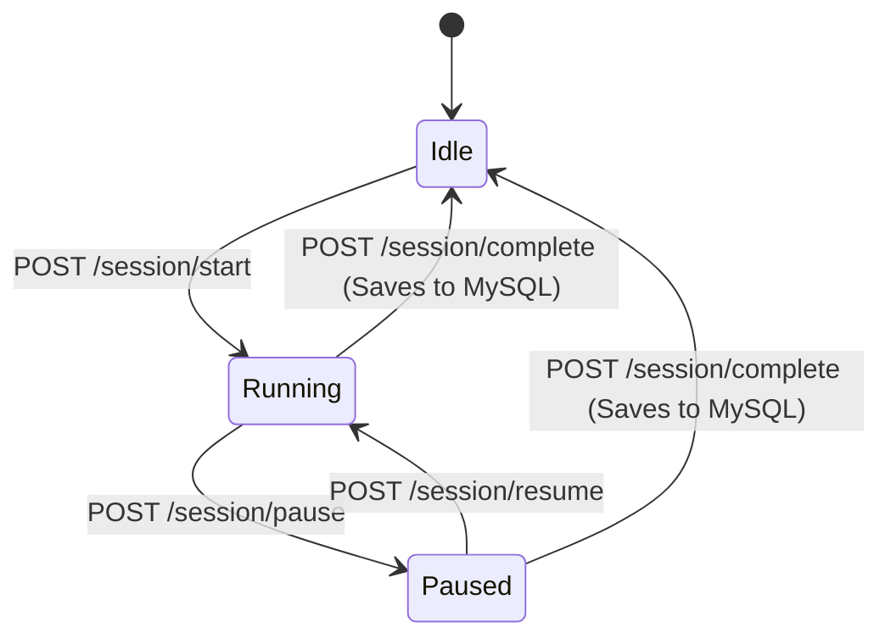

# Cement Factory Dispatch Monitoring System
## Comprehensive System & Code Documentation

This document compiles the **Software Requirements Specification (SRS)**, **Activity & Data Flow Design**, and **Codebase Implementations** for the Cement Factory Dispatch Monitoring System.

---

## 1. Executive Summary & Goals
The **Cement Factory Dispatch Monitoring System** is a real-time, computer-vision-driven solution designed to automate and monitor the dispatch loading process at a cement plant.

### Core Objectives:
* **Automated Counting**: Automatically count cement bags loaded onto dispatch wagons from **25 conveyor belts** using **50 IP cameras** (2 cameras per belt for redundancy and coverage).
* **Session Tracking**: Track the duration and loading history of each dispatch wagon.
* **Low-Latency Monitoring**: Expose real-time bag counts and status updates to a centralized dashboard.
* **Historical Auditing**: Persist completed session summaries to a relational database for auditing and operational planning.

---

## 2. System Architecture & Tech Stack

The system is designed with a decentralized, three-tier architecture to handle heavy video processing at the edge while keeping the central server lightweight and scalable.

```
                   +-------------------+
                   |   50 IP Cameras   |
                   +---------+---------+
                             | RTSP
                             v
               +-------------+-------------+
               |   Edge Processing Layer   |
               | (YOLOv8 + ByteTrack / GPU)|
               +-------------+-------------+
                             | HTTP/REST (JSON Events)
                             v
               +-------------+-------------+
               |    Central Backend API    |
               |         (FastAPI)         |
               +-------+-------------+-----+
                       |             |
                 RESP  |             | TCP/IP
                       v             v
                +------+------+ +----+----+
                | Redis Cache | |  MySQL  |
                | (Live State)| | (Vault) |
                +-------------+ +---------+
```

### Technology Stack details:
* **Edge Inference**: YOLOv8 (Nano model for edge performance) + ByteTrack for object detection and persistent tracking. Runs inside Docker containers to allow access to local GPU resources.
* **Orchestration**: Docker Swarm manages container placements across **12–13 physical edge GPU nodes** (running 4–5 stream containers per node) and supports automatic container recovery.
* **Central Backend**: FastAPI (Python) web server handling lightweight API events.
* **Caching (Live State)**: Redis (In-memory database) for sub-millisecond status updates and real-time dashboard consumption.
* **Relational Storage (Permanent Vault)**: MySQL for persisting audited session results.
* **Frontend**: Flutter Web Dashboard (polls or connects via WebSockets to FastAPI for displaying analytics and manual controls).

---

## 3. System Interfaces & Data Flow

### 3.1 Session Lifecycle States
Unlike a fixed timer-based loop, the session lifecycle is controlled manually by operators via the dashboard to accommodate deliberate conveyor belt stops:



1. **Idle**: The conveyor belt is inactive, and no session is running. All camera crossings are ignored.
2. **Running**: An active loading session is in progress. The edge node tracks bags crossing the line and reports increments.
3. **Paused**: The loading process is temporarily suspended (e.g., belt stopped for adjustments). Crossing events are ignored, and the session's active loading timer is frozen.

### 3.2 Deduplication Strategy
To prevent double-counting caused by network retries or back-and-forth movement, the edge node assigns a persistent ID to each bag using **ByteTrack**. When a bag crosses the counting boundary, the edge reports the crossing event with a unique `bag_id`. 

The backend stores counted bag IDs inside a **Redis Set** for the active session. If a request containing an already processed `bag_id` arrives, the backend ignores it.

---

## 4. Codebase Specification

### 4.1 Central Backend: [backend/main.py](file:///c:/Users/13shi/Pictures/cement-dispatch/backend/main.py)
The central backend defines schemas and exposes API endpoints to update Redis and persist completed records in MySQL.

#### Key Schemas:
* `CountPayload`: Expects `belt_id` (str), `bag_id` (str), and `timestamp` (float).
* `SessionControlPayload`: Expects `belt_id` (str).

#### Exposed Endpoints:
* **`POST /api/v1/session/start`**: Resets the Redis live count to 0, deletes old deduplication sets, and transitions status to `"running"`.
* **`POST /api/v1/session/pause`**: Transitions status to `"paused"` and logs the pause timestamp.
* **`POST /api/v1/session/resume`**: Calculates the paused duration and transitions status back to `"running"`.
* **`POST /api/v1/session/complete`**: Stops the active session, calculates the net active loading duration (excluding paused time), inserts a row in MySQL, resets Redis status to `"idle"`, and clears deduplication sets.
* **`GET /api/v1/session/status/{belt_id}`**: Dynamically calculates and returns current status, live count, and running active duration.
* **`POST /api/v1/count_increment`**: Performs Redis Set deduplication and increments the live count.

---

### 4.2 Edge Node: [edge_node/belt_processor.py](file:///c:/Users/13shi/Pictures/cement-dispatch/edge_node/belt_processor.py)
Runs locally on the edge nodes and manages the camera streams.

#### Core Loop:
1. **Background Polling Thread**: Checks the backend `/api/v1/session/status/{belt_id}` endpoint every 1.0s to dynamically adjust its internal status (`running`, `paused`, `idle`).
2. **YOLOv8 & ByteTrack Ingestion**: Ingests RTSP stream frames, detects cement bags, and tracks them using persistent tracking IDs.
3. **Boundary Check**: If the bag center crosses `COUNTING_LINE_X`, it qualifies as a crossing.
4. **Action**:
   * If status is `"running"` and the ID is new, it sends a payload to `/api/v1/count_increment` with the tracking ID as the `bag_id`.
   * Otherwise, the crossing is discarded.
5. **OpenCV GUI Overlay**: Draws bounding boxes, tracking IDs, the counting boundary, and displays the live status and count fetched from the backend.

---

### 4.3 Database Infrastructure: [infrastructure/docker-compose.yml](file:///c:/Users/13shi/Pictures/cement-dispatch/infrastructure/docker-compose.yml)
Defines container services to spin up local developer databases:
* **Redis**: Runs on port `6379`.
* **MySQL 8.0**: Runs on port `3306` (stores records under database `cement_dispatch`).

---

## 5. Local Setup & Execution Guide

Follow these steps to run the complete pipeline on your local environment:

### Step 1: Start Databases
Ensure Docker Desktop is running, navigate to the `infrastructure` folder, and start the databases:
```powershell
cd infrastructure
docker-compose up -d
```

### Step 2: Install Python Dependencies
Install the required packages for both the backend and edge nodes:
```powershell
pip install fastapi uvicorn redis pymysql numpy opencv-python ultralytics requests
```

### Step 3: Run the Central Backend
Start the FastAPI server from the `backend` folder:
```powershell
cd ../backend
uvicorn main:app --reload --port 8000
```
*The API interactive documentation will be available at http://localhost:8000/docs.*

### Step 4: Run the Edge Processor
Run the vision simulator from the `edge_node` folder:
```powershell
cd ../edge_node
python belt_processor.py
```
*An OpenCV window will appear showing the video feed in an `IDLE` state.*

### Step 5: Test the manual controls
Using a API client (like Postman or PowerShell), trigger the session controls:
* **Start Session**:
  ```powershell
  Invoke-RestMethod -Uri http://localhost:8000/api/v1/session/start -Method Post -ContentType "application/json" -Body '{"belt_id": "belt_01"}'
  ```
  *(Watch the OpenCV overlay transition to `RUNNING` and start counting bags!)*
* **Pause Session**:
  ```powershell
  Invoke-RestMethod -Uri http://localhost:8000/api/v1/session/pause -Method Post -ContentType "application/json" -Body '{"belt_id": "belt_01"}'
  ```
* **Complete Session**:
  ```powershell
  Invoke-RestMethod -Uri http://localhost:8000/api/v1/session/complete -Method Post -ContentType "application/json" -Body '{"belt_id": "belt_01"}'
  ```
