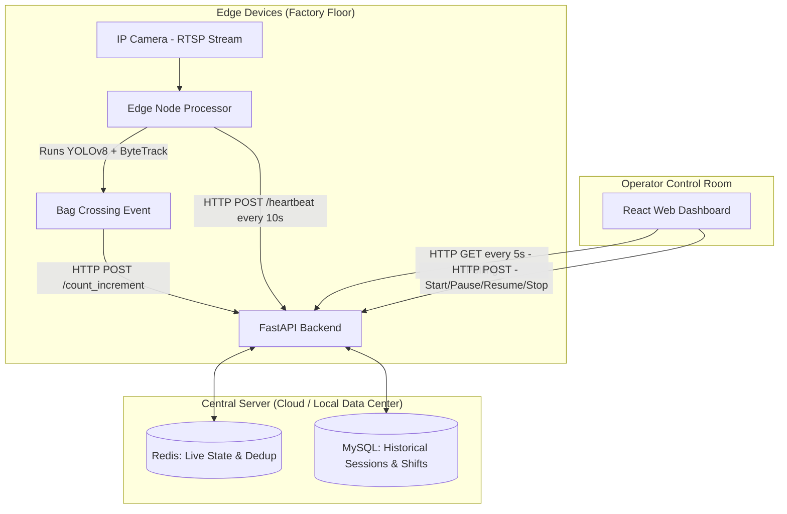

# Cement Dispatch Monitoring System
**Developer Documentation & Technical Reference**

---

## 1. Project Overview

The **Cement Dispatch Monitoring System** is an automated, computer-vision-based solution designed to track cement bags as they are loaded onto dispatch wagons across **25 parallel conveyor belts** at a cement factory.

Instead of relying on human operators to tally bags manually, this system deploys **Edge AI nodes** (running YOLOv8 + ByteTrack) directly on the factory floor. These nodes detect bags crossing a configurable counting line and send real-time HTTP events to a **Central Server**, which aggregates counts, manages loading sessions, computes shift analytics, and serves a live dashboard for floor supervisors.

---

## 2. System Architecture

The project uses a **Hybrid Edge-Cloud Architecture**:



### 2.1 The Flow of Data
1. **Video Ingestion:** An RTSP stream (or local video file for dev) is ingested by an edge node.
2. **AI Inference:** YOLOv8 Nano detects cement bags in each frame. ByteTrack assigns persistent IDs across frames.
3. **Line Crossing Detection:** When a tracked bag's center crosses a configurable **horizontal counting line** (Y-axis threshold), an event is fired.
4. **Deduplication & Counting:** The edge node POSTs the `bag_id` to the backend. The backend adds the ID to a Redis Set — if it already exists, the count is *not* incremented (O(1) dedup).
5. **Dashboard Sync:** The React dashboard polls the backend every 5 seconds for live counts, edge health, and shift data. Client-side timers tick every 1 second for a smooth UI experience.

---

## 3. Technology Stack

### 🧠 Edge AI Node
| Technology | Purpose |
|---|---|
| **Python 3.x** | Runtime |
| **Ultralytics YOLOv8 (Nano)** | Object detection — chosen for edge GPU efficiency (~3–8ms/frame on NVIDIA) |
| **ByteTrack** | Multi-object tracking — assigns persistent IDs across frames |
| **OpenCV** | Video stream handling (RTSP and local file), frame rendering |
| **Requests** | HTTP POST to backend with exponential backoff retry |

### ⚙️ Central Backend
| Technology | Purpose |
|---|---|
| **FastAPI** | High-performance async Python web framework |
| **Redis** | Live state engine — session status, live counts, dedup sets, heartbeats, shift tracking |
| **MySQL 8.0** | Permanent vault — stores completed `sessions` and aggregated `shifts` |
| **PyMySQL** | Python MySQL driver (with DictCursor for JSON-friendly results) |

### 🖥️ Frontend Dashboard
| Technology | Purpose |
|---|---|
| **React 18 + Vite** | Component-based SPA with fast HMR |
| **Tailwind CSS v3** | Utility-first CSS framework |
| **Lucide React** | SVG icon library |
| **Material Symbols** | Additional icon set for UI elements |

### 🏗️ Infrastructure & Deployment
| Technology | Purpose |
|---|---|
| **Docker + Docker Compose** | Local dev orchestration (Redis + MySQL) |
| **Docker Swarm** | Production deployment with GPU node constraints |
| **Nginx** | Serves the production frontend build |

---

## 4. Directory Structure

```text
cement-dispatch/
│
├── backend/                        # Central API Server
│   ├── main.py                     # FastAPI app — all routes, Redis/MySQL logic
│   ├── requirements.txt            # Python dependencies
│   ├── Dockerfile                  # Container definition
│   ├── .env                        # Local environment config
│   └── .env.example                # Template for environment variables
│
├── frontend/                       # React Web Dashboard
│   ├── src/
│   │   ├── App.jsx                 # Root component — state management, data fetching, routing
│   │   ├── main.jsx                # React DOM entry point
│   │   ├── index.css               # Tailwind directives + global styles
│   │   └── components/
│   │       ├── TopNav.jsx          # Top navigation bar (logo, global stats, error banner)
│   │       ├── SideNav.jsx         # Side navigation tabs with badges
│   │       ├── LiveMonitor.jsx     # TAB 1 — 25-belt live monitoring grid with controls
│   │       ├── ShiftSummary.jsx    # TAB 2 — Active/last shift + shift history + drill-down
│   │       ├── AuditLog.jsx        # TAB 3 — Current shift's completed session records
│   │       └── SystemHealth.jsx    # TAB 4 — Edge node online/offline status table
│   ├── index.html                  # HTML entry point (Google Fonts loaded here)
│   ├── vite.config.js              # Vite bundler config
│   ├── tailwind.config.js          # Tailwind theme extensions
│   ├── package.json                # Node dependencies
│   ├── Dockerfile                  # Multi-stage build (npm build → Nginx serve)
│   └── nginx.conf                  # Nginx reverse proxy config
│
├── edge_node/                      # Edge AI Inference Scripts
│   ├── belt_processor.py           # Core CV script — reads video, YOLO inference, sends counts
│   ├── simulate_load.py            # Dev tool — simulates edge API calls without GPU
│   ├── config.json                 # Per-belt config (belt_id, video_source, counting_line_y)
│   ├── best.pt                     # Custom-trained YOLOv8 model weights for cement bags
│   ├── requirements.txt            # Python dependencies
│   ├── Dockerfile                  # Container definition (ultralytics base image)
│   ├── .env                        # Local environment overrides
│   └── .env.example                # Template for environment variables
│
└── infrastructure/                 # Deployment & Orchestration
    ├── docker-compose.yml          # Local dev (spins up Redis + MySQL containers)
    ├── docker-swarm-stack.yml      # Production Swarm definition (GPU node constraints)
    ├── deploy.sh                   # Linux: one-click Swarm deployment automation
    ├── deploy.ps1                  # Windows: one-click Swarm deployment automation
    └── DEPLOYMENT.md               # Step-by-step production deployment guide
```

---

## 5. Core Concepts & Lifecycles

### 5.1 Session Lifecycle
A **session** represents a continuous period of loading bags onto a single belt. Operators control it manually from the dashboard.

```
   ┌─────┐   Start    ┌─────────┐   Pause    ┌────────┐
   │ Idle │──────────►│ Running │──────────►│ Paused │
   └─────┘           └─────────┘           └────────┘
      ▲                    │                    │
      │                    │ Stop               │ Resume
      │                    ▼                    │
      │              ┌───────────┐              │
      └──────────────│ Completed │◄─────────────┘
                     └───────────┘     Stop
                          │
                          ▼
                   Saved to MySQL
```

- **Idle → Running:** Operator clicks "Start". Backend creates Redis keys for live tracking.
- **Running → Paused:** Operator clicks "Pause". Timer stops, edge counts are ignored.
- **Paused → Running:** Operator clicks "Resume". Timer resumes, paused duration is tracked.
- **Running/Paused → Completed:** Operator clicks "Stop". Final count and active duration are written to the MySQL `sessions` table. Redis keys are cleaned up.

### 5.2 Shift Analytics
A **shift** is a higher-level aggregate that spans the entire factory floor:

- **Shift Start:** Triggered automatically when the **first** belt starts (any belt goes from `idle` → `running`).
- **Shift Active:** While *any* belt is `running` or `paused`, the shift is active. The dashboard shows real-time totals.
- **Belt Participation Tracking:** Every belt that starts during a shift is added to a Redis Set (`shift:active_belts`). This ensures belts with **0 bags** still appear in the final summary.
- **Shift Complete:** When the **last** active belt is stopped (all 25 belts are `idle`), the backend finalizes the shift — calculates total bags, duration, and belt-wise breakdown, saves it to the MySQL `shifts` table.

### 5.3 Edge Node Health Tracking
- Each edge node runs a background daemon thread that sends `POST /api/v1/heartbeat` every **10 seconds**.
- The backend stores the timestamp in Redis (`belt_XX:last_heartbeat`).
- The dashboard considers a belt **OFFLINE** if its last heartbeat is older than **15 seconds**.
- The System Health tab shows all 25 belts sorted by status (offline first).

### 5.4 Bag Deduplication (O(1))
Two layers of deduplication prevent double-counting:

1. **Edge-side:** The edge node maintains a local `counted_ids` Python set. A bag is only sent to the backend once — when it first crosses the counting line.
2. **Backend-side:** The backend adds the `bag_id` to a Redis Set (`belt_XX:counted_bags`). If `SADD` returns 0 (already exists), the count increment is skipped. This protects against network retries or edge restarts.

### 5.5 Counting Line Configuration
The edge processor uses a configurable **horizontal counting line** (Y-axis):

- Bags move **top to bottom** in the camera view.
- A bag is counted when its bounding box center Y crosses **below** the `COUNTING_LINE_Y` threshold.
- The red line is drawn on the live video window for visual confirmation.
- Configured via `config.json` → `"counting_line_y": 400` or environment variable `COUNTING_LINE_Y`.

### 5.6 Frame Skip Optimization (CPU Dev Mode)
On laptops without a GPU, YOLOv8 inference is slow (~150–400ms/frame). To keep the video display smooth:

- `INFERENCE_EVERY_N_FRAMES = 2` — YOLO runs on every 2nd frame.
- Skipped frames reuse the last detection result (bounding boxes stay visible).
- Set to `1` in production (GPU) for full-speed processing.

---

## 6. API Reference

### Session Control
| Method | Endpoint | Description |
|---|---|---|
| `POST` | `/api/v1/session/start` | Start a new loading session for a belt |
| `POST` | `/api/v1/session/pause` | Pause a running session |
| `POST` | `/api/v1/session/resume` | Resume a paused session |
| `POST` | `/api/v1/session/complete` | Stop and finalize a session → saved to MySQL |
| `GET` | `/api/v1/session/status/{belt_id}` | Get live status, count, duration, online status |

### Edge Node Communication
| Method | Endpoint | Description |
|---|---|---|
| `POST` | `/api/v1/count_increment` | Report a bag crossing (with dedup) |
| `POST` | `/api/v1/heartbeat` | Edge health ping (every 10s) |

### Data Retrieval
| Method | Endpoint | Description |
|---|---|---|
| `GET` | `/api/v1/sessions` | All completed sessions (last 50) |
| `GET` | `/api/v1/sessions/current-shift` | Sessions belonging to the current/last shift only |
| `GET` | `/api/v1/shifts` | All completed shifts (last 30) |
| `GET` | `/api/v1/shifts/{shift_id}` | Full shift detail + individual session breakdown |
| `GET` | `/api/v1/shift/current` | Live state of the active shift |
| `GET` | `/api/v1/shift/last` | Most recently completed shift summary |
| `GET` | `/api/v1/live_count/{belt_id}` | Raw live count from Redis |

### Request/Response Payloads
**`POST /api/v1/count_increment`**
```json
{ "belt_id": "belt_01", "bag_id": "42", "timestamp": 1719446400.123 }
```

**`GET /api/v1/session/status/belt_01`** → Response:
```json
{
  "belt_id": "belt_01",
  "status": "running",
  "live_count": 15,
  "active_duration": 245.7,
  "is_online": true,
  "last_heartbeat": 1719446395.0
}
```

---

## 7. Database Schema

### `sessions` Table
| Column | Type | Description |
|---|---|---|
| `id` | `INT AUTO_INCREMENT PK` | Unique session ID |
| `belt_id` | `VARCHAR(50)` | Which belt (e.g., `belt_01`) |
| `start_time` | `DOUBLE` | Unix epoch — session start |
| `end_time` | `DOUBLE` | Unix epoch — session end (active duration only) |
| `total_count` | `INT` | Bags counted (can be 0) |
| `created_at` | `TIMESTAMP` | When the record was inserted |

### `shifts` Table
| Column | Type | Description |
|---|---|---|
| `id` | `INT AUTO_INCREMENT PK` | Unique shift ID |
| `start_time` | `DOUBLE` | Unix epoch — first belt started |
| `end_time` | `DOUBLE` | Unix epoch — last belt stopped |
| `total_bags` | `INT` | Sum of all bags across all belts |
| `belt_summary` | `JSON` | `{"belt_01": 15, "belt_03": 0, ...}` — includes 0-count belts |
| `created_at` | `TIMESTAMP` | When the record was inserted |

> **Note:** There is no foreign key between `sessions` and `shifts`. Sessions are associated with shifts at query time via time-window overlap: `sessions.start_time BETWEEN shifts.start_time AND shifts.end_time`.

---

## 8. Redis Key Reference

| Key Pattern | Type | Purpose |
|---|---|---|
| `belt_XX:status` | String | `idle`, `running`, or `paused` |
| `belt_XX:live_count` | String (int) | Current bag count for active session |
| `belt_XX:start_time` | String (float) | Unix epoch when session started |
| `belt_XX:total_paused_time` | String (float) | Accumulated pause duration |
| `belt_XX:last_pause_time` | String (float) | When the current pause began |
| `belt_XX:counted_bags` | Set | Bag IDs already counted (dedup) |
| `belt_XX:last_heartbeat` | String (float) | Last edge heartbeat timestamp |
| `belt_XX:last_updated` | String (float) | Last count increment timestamp |
| `shift:active` | String | `"1"` if a shift is in progress |
| `shift:start_time` | String (float) | When the current shift started |
| `shift:active_belts` | Set | All belt IDs that participated in this shift |
| `shift:belt_XX:count` | String (int) | Per-belt running total for the active shift |

---

## 9. Local Development Setup

### Prerequisites
- Docker Desktop (for Redis + MySQL containers)
- Python 3.10+
- Node.js 18+

### Step 1: Start Databases
```bash
cd infrastructure
docker-compose up -d
```
*Starts Redis on port `6379` and MySQL on port `3306`.*

### Step 2: Start the Backend
```bash
cd backend
python -m venv venv
# Windows: venv\Scripts\activate | Mac/Linux: source venv/bin/activate
pip install -r requirements.txt
uvicorn main:app --reload --port 8000
```

### Step 3: Start the Frontend
```bash
cd frontend
npm install
npm run dev
```
*Open `http://localhost:5173` in your browser.*

### Step 4: Simulate Edge Traffic (No GPU Required)
```bash
cd edge_node
python simulate_load.py
```
*Start some belts on the dashboard, then watch the simulator auto-increment the counts.*

### Step 5: Run Real CV Pipeline (GPU or Video File)
```bash
cd edge_node
python belt_processor.py
```
*Configure `config.json` to point to your video file or RTSP stream. Adjust `counting_line_y` to match the crossing point in your camera view.*

### Useful Commands
```bash
# Clear all Redis data (live state)
docker exec -it infrastructure-redis-1 redis-cli FLUSHALL

# Clear all MySQL data (historical records)
docker exec -it infrastructure-mysql-1 mysql -u api_user -papipassword cement_dispatch -e "TRUNCATE TABLE sessions; TRUNCATE TABLE shifts;"
```

---

## 10. Production Deployment

The system is deployed using **Docker Swarm** across a central manager node and GPU-enabled worker nodes.

Key requirements:
1. **Manager node** (central server) — runs Backend, Frontend, Redis, MySQL.
2. **Worker nodes** (edge devices with NVIDIA GPUs) — run the CV pipeline containers.
3. **Node labeling** — `docker node update --label-add gpu=true <node_id>` to ensure edge containers are scheduled correctly.

For the complete step-by-step guide, see **[infrastructure/DEPLOYMENT.md](infrastructure/DEPLOYMENT.md)**.

---

## 11. Known Gaps / Pending Work

| Item | Priority | Description |
|---|---|---|
| **JWT Authentication** | 🔴 High | Dashboard endpoints are currently unprotected. Need `POST /auth/login` → JWT token, with all dashboard routes requiring `Authorization: Bearer <token>`. |
| **Edge API Key** | 🟡 Medium | Edge-facing endpoints (`/count_increment`, `/heartbeat`) need `X-API-Key` header validation to prevent spoofed counts. |
| **RTSP Reconnection** | 🟡 Medium | `belt_processor.py` needs a `try/except` loop around `cv2.VideoCapture` to auto-reconnect if a factory IP camera reboots mid-shift. |
